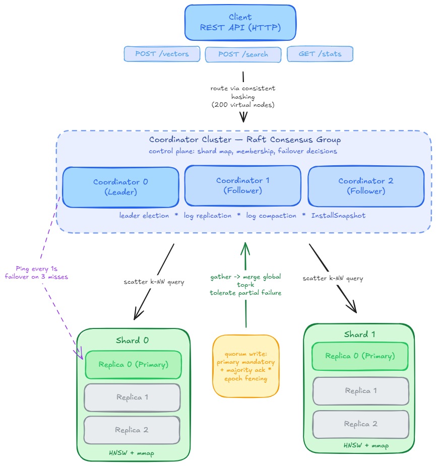

<div align="center">

# Nano-DB-Replica-Recall

[](https://en.cppreference.com/w/cpp/17)
[](https://github.com/shlokkvaishnav/Nano-DB-Replica-Recall/actions)
[](LICENSE)
[](https://github.com/shlokkvaishnav/Nano-DB-Replica-Recall/pkgs/container/nano-db)

**Does search quality silently diverge across replicas of an approximate index under node failure — and does it ever come back?**

</div>

---

## Research question

Does node-failure chaos cause measurable, replica-level search-quality divergence in a replicated HNSW-based vector database; does that divergence persist after full cluster recovery; and can a ground-truth-free peer-agreement signal detect the degraded replica?

## Why this matters

An exact key-value store that loses a row returns *not found* — an observable event a consistency checker can flag. An approximate nearest-neighbour index that loses vectors, or whose graph degrades, still returns *k* plausible-looking neighbours. Nothing about the response says anything is wrong. **Approximation converts data loss into silence.** No published Jepsen-style analysis has ever targeted a vector database; no streaming-ANN benchmark injects node failure; no production anti-entropy mechanism (Weaviate's hash-tree replication, Vespa's checksummed reconciliation, Dynamo/Cassandra Merkle repair) can be pointed at an ANN graph, because two correct HNSW graphs over identical data differ bit-for-bit. Full positioning against prior work: [`research/RELATED_WORK.md`](research/RELATED_WORK.md).

## What we investigate

`research/replica_recall/` runs a controlled node-kill chaos protocol against a live cluster and probes each replica directly (bypassing the coordinator's scatter-gather, which would merge replicas and hide the divergence). It decomposes "the search is bad" into three ground-truth-backed measurements that move independently — `index_recall` (graph quality, data held constant), `completeness` (data content, no search involved), `e2e_recall` (what a client actually experiences) — plus a fourth, `agreement`, computed with **no ground truth**, to test whether peer disagreement can substitute for it. A quiesce protocol (stop chaos, keep watching) then separates *transient replication lag* from *permanent, unrecovered loss*.

## Current findings

**ESTABLISHED** — supported directly by the experiments in this repo:
> On this system (nano-db: 2 shards × 3 replicas, from-scratch C++ HNSW + Raft), under node-kill chaos on real SIFT1M data (5 seeds), `index_recall` and `completeness` both degrade measurably and statistically significantly versus a no-chaos baseline (exact Mann-Whitney at the n=5 floor, p = 0.0079). Independently-built healthy replicas agree to 1e-4, so ordinary ANN nondeterminism does not explain the gap. Missing data has not returned in any observed post-recovery window.

**HYPOTHESIS** — under active investigation, not yet confirmed:
> That a ground-truth-free peer-agreement statistic (`loo_agreement`) can identify the degraded replica above chance, making it usable as a production detector for a failure mode that is currently invisible. That this failure mode generalizes beyond this one implementation.

**OPEN** — unresolved questions this repo does not answer:
> The root cause of why `index_recall` degrades under chaos. A dedicated forensic tool (`graph_forensics.py`) found no average difference in neighbour-list quality between baseline and chaos replicas — except one replica, never itself killed, that lost reachability to 58.7% of its own graph while every structural check on it looked clean. Two specific hypotheses were tested and ruled out with clean reproductions; the actual mechanism is still unknown. Full writeup: [`docs/postmortems/catastrophic-disconnection.md`](docs/postmortems/catastrophic-disconnection.md). Whether the divergence effect scales with corpus size is also untested.

**DO NOT CLAIM** — statements this evidence does not support:
> "Approximate indexes have no observable correctness criterion under replication" as a general claim (true as a motivating intuition, unproven beyond n=1 system). "Vector databases silently lose data" in general (Milvus #37703 shows a genuinely *loud* failure — the honest claim is that approximation *permits* silence, not that it's universal). "No vector DB repairs missing data" (Weaviate/Vespa do, at the object level — the gap is that object-level repair cannot see graph-level damage). "We understand why recall degrades" (mechanism is open, see above). Anything implying this generalizes to Qdrant, Milvus, Weaviate, or production deployments — untested.

## Methodology, in brief

- **Probes bypass the coordinator** — direct gRPC calls to each replica, so scatter-gather can't average the divergence away.
- **A settling window** (default 2s) prevents normal replication lag from being counted as loss.
- **A baseline-first protocol** — every chaos run is compared against a no-fault run on the same corpus, because HNSW insertion order alone produces some cross-replica disagreement even when nothing is broken.
- **Corpus choice is load-bearing.** Uniform-random vectors suffer distance concentration and hide the effect entirely (p = 0.31); real SIFT1M data separates cleanly (p = 0.0079). A benchmark built on synthetic data would have concluded there was nothing to find.
- **The seed sweep is what's reported**, not a single run — an exact two-sided Mann-Whitney U test compares 5 seeds per condition.

Full methodology, every design decision and why, known limits: [`research/replica_recall/README.md`](research/replica_recall/README.md).

## Repository structure

```
research/                    the research: methodology, experiments, findings
  README.md                  research contract + experiment index
  RELATED_WORK.md            literature positioning, what's already claimed by others
  replica_recall/            Layer 1 — the measurement harness (see its own README)
    RESULTS.md               raw-data status (currently unpopulated — see below)

docs/
  postmortems/                two historical investigations that fed the research
    recall-bugs.md            how the original recall-measurement bugs were found
    catastrophic-disconnection.md   the open 58.7%-loss investigation
  architecture/               reference material for the experimental system itself
    INTERNALS.md              Raft / HNSW / storage engine internals
    images/

benchmarks/
  research/                  benchmark_recall.cpp — load-bearing: the tool whose
                              46% recall reading triggered the recall-bug investigation
  portfolio/                 general perf benchmarks, not part of the research findings

demo/                        chaos-tolerance demo (cluster.sh, demo_chaos.py) —
                              showcases the system, not the research

cluster/, include/, src/, proto/, tests/    the experimental system (Raft + HNSW +
                                             gRPC replication) — infrastructure the
                                             research runs on, not the contribution
```

`cluster/`, `include/`, `src/`, `proto/`, and `tests/` implement nano-db, the vector database this research measures. **Nano-DB is the experimental system, not the research contribution** — the contribution is the measurement methodology and findings in `research/`.

## Reproducing the experiment

Requires Linux with the cluster binaries built (the harness launches processes directly; no Docker).

```bash
pip install grpcio grpcio-tools numpy
cmake -B build -DCMAKE_BUILD_TYPE=Release -DNANODB_BUILD_CLUSTER=ON
cmake --build build -j$(nproc)

python research/replica_recall/run_experiment.py --duration 180 --no-chaos   # baseline
mv research/replica_recall/results research/replica_recall/results_baseline
python research/replica_recall/run_experiment.py --duration 300              # chaos

python research/replica_recall/analyze.py
```

For the full seed sweep this project's numbers are reported from, corpus choice, the quiesce/healing protocol, and graph forensics: [`research/replica_recall/README.md`](research/replica_recall/README.md).

## Current results

The numbers in **Current findings** above come from a 5-seed sweep on real SIFT1M data. **Raw per-seed results are not currently committed to this repository** — the harness requires Linux and built cluster binaries, and has not been (re-)run in every development environment this project has used. [`research/replica_recall/RESULTS.md`](research/replica_recall/RESULTS.md) documents this gap explicitly and gives the exact commands to regenerate the data. No numbers here are backfilled or estimated.

## Limitations

Single system, single from-scratch implementation — not yet shown to generalize (the single biggest open question). 5 seeds, which sits at the exact statistical floor for the rank test used (p = 0.0079 is the smallest attainable value at n=5, so it indicates the groups separate completely rather than that the effect is large). Ground truth is brute-force, practical only to ~10⁵–10⁶ vectors — a mechanism study, not a scale study. `chaos_harness.py` uses SIGKILL, which does not lose dirty mmap pages — machine-level crash consistency is a separate, unaddressed gap. Full list: the "Known limits" section of [`research/replica_recall/README.md`](research/replica_recall/README.md#known-limits).

## Open research questions / next experiments

1. **Cross-system replication** (highest priority) — point the same probe/decompose/quiesce protocol at a second real vector database (Qdrant or Weaviate). This is the step that would turn a measurement of one system into a contribution about the field.
2. **Root-cause closure** on the 58.7%-loss anomaly.
3. **Larger seed count or bootstrap confidence intervals**, beyond the n=5 statistical floor.
4. **Scale sensitivity** beyond the current brute-force ground-truth cap.
5. **Detector robustness** — does `loo_agreement` still work against non-pinned, realistic query traffic?

## Related work

The closest prior art is Wang et al.'s *Towards Reliable Vector Database Management Systems* (arXiv:2502.20812), which names the ANN "oracle problem" but never discusses replication or fault injection. Streaming-ANN benchmarks (FreshDiskANN, SPFresh, the NeurIPS'23 Big-ANN track) measure recall decay under churn on one machine, with no replication dimension. Jepsen-family checkers assume a read has one correct value, which an approximate index doesn't have. Full positioning, per-paper summaries, and — importantly — the specific claims this project must *not* make because prior work already covers them: [`research/RELATED_WORK.md`](research/RELATED_WORK.md).

## License / citation

MIT — see [`LICENSE`](LICENSE). If this work is useful, please cite the repository; a formal citation format will be added if/when this research is written up for submission (see `research/RELATED_WORK.md` for candidate venues).

---

## Appendix: the experimental system

Everything below describes **Nano-DB**, the Raft-replicated vector database the research above runs on — infrastructure, not the research contribution.

### What it is

A distributed vector database built from first principles in C++17 — no consensus library, no managed queue, no distributed key-value store. Every distributed systems primitive here is implemented from scratch: the Raft log, the quorum write protocol, the consistent hash ring, the epoch fence.

**If you need a production vector database, use [Qdrant](https://qdrant.tech) or [Milvus](https://milvus.io).** This project exists to understand what's inside them, and to have a controllable, inspectable system to run the replica-recall research on.

### Quick start

```bash
git clone --recurse-submodules https://github.com/shlokkvaishnav/Nano-DB-Replica-Recall.git
cd Nano-DB-Replica-Recall
./demo/cluster.sh up          # boots a 2-shard x 3-replica cluster + Grafana
python3 demo/demo_chaos.py    # kills the Raft leader mid-write, verifies zero writes dropped
./demo/cluster.sh chaos       # 60s of continuous random process kills, invariant report at the end
```



Three Raft coordinators handle write/failover consensus; each of 2 shards has 3 replicas behind consistent hashing, with quorum writes and epoch-fenced failover. Three invariants are checked continuously: no confirmed write disappears, no split-brain, full recovery after chaos stops — a stronger but narrower guarantee than what `research/replica_recall/` measures above (write survival at the cluster level, not per-replica search *quality*).

| Metric | Value |
|--------|-------|
| Cluster insert throughput (Docker, 4 clients) | 146 vec/s |
| Search latency p50 / p99 (Docker, 167k vectors) | 5.9 ms / 27.9 ms |
| Failover recovery | 0.5 s |
| Raft leader election | < 1 s |
| Recall@10 (synthetic data — see caveat) | ≤ 81.6%, `ef_search`-dependent |

These numbers are mostly un-re-measured since first written and largely run on synthetic data, which is why `research/replica_recall/` re-measures recall on real SIFT1M instead — see [`docs/postmortems/recall-bugs.md`](docs/postmortems/recall-bugs.md) for what synthetic-data numbers hid on this project specifically. Full table, footnotes, benchmark methodology, and tail-latency scaling model: [`docs/architecture/INTERNALS.md`](docs/architecture/INTERNALS.md).

### Building & testing

```bash
mkdir build && cd build
cmake .. -DCMAKE_BUILD_TYPE=Release -DNANODB_BUILD_CLUSTER=ON
cmake --build . -j$(nproc)
ctest --output-on-failure   # 9 unit tests
```

Requires CMake 3.16+, g++ 13+, `protobuf-compiler`, `libgrpc++-dev`, `libomp-dev` (Docker builds need none of this locally). `research/replica_recall/test_metrics.py` separately validates the measurement core the research findings depend on (75 checks, no cluster needed). Full internals — mmap storage layout, HNSW graph, SIMD kernels, Raft leader election and the Figure 8 commit rule, observability: [`docs/architecture/INTERNALS.md`](docs/architecture/INTERNALS.md).
