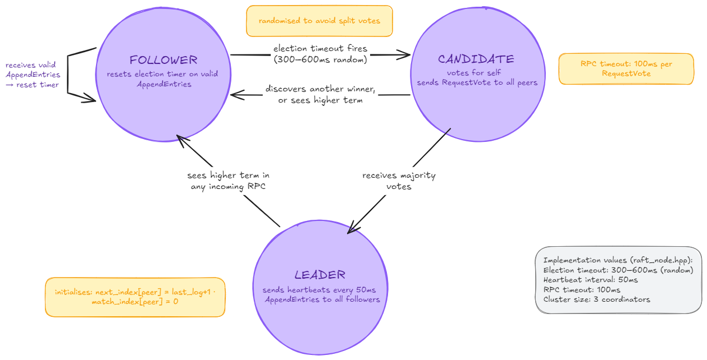
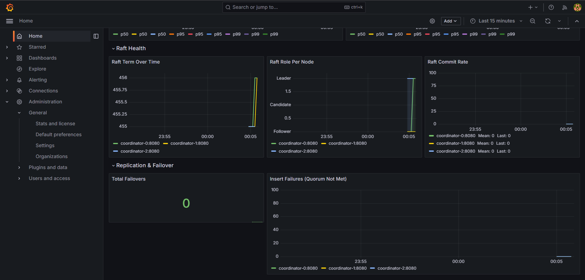

# Distributed Nano-DB — Complete Technical Internals

This document explains every design decision in Distributed Nano-DB at the level of detail a senior engineer would need to modify or extend the codebase without reading the source first. It covers the full system: single-node storage engine, HNSW index, SIMD kernels, consistent hashing, gRPC inter-node RPC, primary-replica replication, Raft consensus, automatic failover, chaos testing, and observability. The final section is structured interview prep.

---

## 1. MMap Storage Engine

**Files:** `include/storage/memory_map.hpp`, `src/storage/memory_map.cpp`

### Why mmap instead of fread

`fread()` copies data from the kernel's page cache into a user-space buffer on every call — a full `memcpy` per read. This means every read allocates memory, copies it, and your application must manage its own buffer pool. `mmap()` eliminates all three problems by creating a mapping in the process's virtual address space that points directly at the kernel's page cache. No copy. The data lives in exactly one place in physical memory.

**Demand paging.** The OS does not load the entire file into RAM when `mmap()` is called. It marks pages as "not present" in the page table. On first access, a page fault fires, the kernel loads the 4KB page from disk into the page cache, updates the page table entry, and execution resumes transparently. A 100GB file can be mapped on an 8GB machine — the OS pages in what you access and evicts what you don't using LRU replacement.

**Zero-copy.** After a page is resident, access is a normal memory load. The TLB caches the virtual→physical translation. Subsequent reads hit L1/L2 cache with no kernel involvement.

**Zero deserialization.** The `Node` struct is POD (Plain Old Data — no pointers, no vtable, no heap allocations). It can be directly read from and written to disk. When `mmap` maps `index.ndb`, the `Node` structs are immediately accessible in memory at their correct offsets. There is no parse step, no fixup pass, no conversion.

### File pre-allocation

`MMapHandler::open_file(path, min_size)` takes a minimum file size parameter. On a fresh database:

1. Creates or opens the file with read/write permissions.
2. Checks current file size via `fstat()` (POSIX) or `GetFileSizeEx()` (Windows).
3. If smaller than `min_size`, extends it with `ftruncate(fd, min_size)` — pre-fills with zeros.
4. Maps with `mmap(nullptr, size, PROT_READ|PROT_WRITE, MAP_SHARED, fd, 0)` (POSIX) or `CreateFileMapping` + `MapViewOfFile` (Windows).

Pre-allocation is necessary because `mmap()` requires the file to already be at least as large as the requested mapping. You cannot map beyond the end of a file.

### Resize path

`MMapHandler::resize(new_size)` is called when an insert would place a node beyond the current file boundary:

1. `close_file()` — unmaps the current view and closes the file handle.
2. `open_file(path, new_size)` — reopens, extends to `new_size`, remaps.

**Critical implication:** resize invalidates every `Node*` derived from the old mapping. This is why `HNSW` holds `global_resize_lock_` (a `shared_mutex`) exclusively during resize — no thread may be reading or writing nodes while the mapping address changes.

### Interface

| Method | What it does |
|--------|-------------|
| `open_file(path, min_size)` | Creates/opens file, extends to min_size, maps it |
| `close_file()` | Flushes dirty pages (implicit via MAP_SHARED), unmaps, closes handle |
| `resize(new_size)` | close + reopen at larger size — invalidates all prior pointers |
| `get_data()` | Returns `void*` to the start of the mapped region |
| `get_size()` | Returns the current mapped size in bytes |

---

## 2. Offset-Based Addressing

**File:** `include/index/hnsw.hpp` (the `get_node` method)

### The problem with raw pointers

A `Node*` stores an absolute virtual address like `0x7f3a00001000`. This address is assigned by the OS when the process calls `mmap()` and is specific to that process and that invocation. If you write `Node* neighbor = 0x7f3a00005000;` to disk and reload the file in a new process, the OS will map the file at a different base address, and the stored pointer is garbage.

### NanoDB's solution: ID-based offset addressing

NanoDB stores neighbor references as `id_t` values (uint32_t node IDs), not pointers. To access node B from node A's neighbor list:

```cpp
id_t neighbor_id = node_a->neighbors[layer][i];
Node* neighbor = get_node(neighbor_id);
// get_node: base_ptr + HEADER_SIZE + id * sizeof(Node)
```

The `get_node(id)` function:

```cpp
Node* get_node(id_t id) {
    return reinterpret_cast<Node*>(
        (char*)storage_.get_data() + HEADER_SIZE + (size_t)id * sizeof(Node)
    );
}
```

The base address is determined at runtime. The offset arithmetic is constant regardless of base. The same `index.ndb` file works whether mapped at `0x7f00...` or `0x1000...`.

### FileHeader

```cpp
struct FileHeader {
    uint32_t magic;           // 0x4E444200 ("NDB\0") — identifies a valid file
    uint32_t element_count;   // number of inserted nodes
    int32_t entry_point_id;   // HNSW entry point (-1 if empty)
    int32_t max_layer;        // highest occupied layer (-1 if empty)
    char reserved[48];        // padding to 64 bytes for alignment
};
```

A fresh pre-allocated file is all zeros. Since `magic == 0` differs from `NANODB_MAGIC == 0x4E444200`, the constructor knows the file is empty and initializes the header. An existing file has the magic set and the constructor restores state.

---

## 3. Node Layout

**File:** `include/index/graph_node.hpp`

```cpp
struct alignas(32) Node {
    id_t id;                                    // 4 bytes
    int max_layer;                              // 4 bytes — highest layer this node participates in
    bool is_deleted;                            // 1 byte — tombstone flag
    // 23 bytes implicit padding (due to alignas(32))

    val_t vector[config::VECTOR_DIM];           // 512 bytes (128 floats × 4 bytes)
    id_t neighbors[MAX_LAYERS][config::M_MAX0]; // 4 layers × 32 slots × 4 bytes = 512 bytes
    int neighbor_counts[MAX_LAYERS];            // 4 layers × 4 bytes = 16 bytes
};
```

**`alignas(32)`** ensures the struct starts on a 32-byte boundary. This allows AVX2 aligned loads (`_mm256_load_ps`) on the vector field — faster than unaligned loads on some microarchitectures because the processor doesn't need to merge two cache lines.

**Fixed-size requirement.** The offset arithmetic `get_node(id) = base + HEADER_SIZE + id * sizeof(Node)` only works if every node is the same size. `M_MAX0 = 32` slots are allocated in the neighbor array at every layer, even though layers 1–3 only use 16 slots. The wasted space (16 slots × 4 layers × 4 bytes = 256 bytes per node) is the deliberate price of the fixed-size layout.

**`neighbor_counts[layer]`** tracks how many valid neighbors are stored at each layer. Slots beyond this count contain stale data initialized to `0xFFFFFFFF` on construction.

**The disk IS the in-memory format.** When the OS flushes dirty pages, it writes raw bytes. On reload, the same raw bytes are mapped back. `sizeof(Node)` on disk equals `sizeof(Node)` in memory because there's no serialization layer.

---

## 4. HNSW Graph

**File:** `include/index/hnsw.hpp`

### Core idea

HNSW (Hierarchical Navigable Small World) is a multi-layer proximity graph. Upper layers are sparse — few nodes with long-distance connections for fast global navigation. Layer 0 is dense — all nodes with short-distance connections for precise local search.

- **Layer 0:** Contains all nodes. Max `M_MAX0 = 32` neighbors per node.
- **Layers 1–3:** Exponentially fewer nodes. Max `M = 16` neighbors per node.
- **Entry point:** A single globally-stored ID. All searches start here at the highest occupied layer.

### Layer assignment

```cpp
int get_random_level() {
    std::uniform_real_distribution<double> dist(0.0, 1.0);
    double r = dist(rng_);
    int level = 0;
    while (r < (1.0 / config::M) && level < config::MAX_LAYERS - 1) {
        level++;
        r /= (1.0 / config::M);
    }
    return level;
}
```

This draws from a geometric distribution with parameter `1/M`. The probability of being assigned to layer k is approximately `(1/M)^k`. With M=16: 93.75% of nodes exist only at layer 0, 5.86% at layers 0–1, 0.37% at layers 0–2. This creates the natural hierarchy where upper layers are sparse.

### Insert path

1. **Draw random level** `L` for the new node.
2. **Greedy descent from top layer to L+1:** Starting from the entry point at the current `max_layer`, navigate greedily to find the closest existing node at each layer. These are just navigation steps — the new node doesn't insert connections here.
3. **Insert from layer L down to layer 0:** At each layer, find the `ef_construction` nearest neighbors using a priority queue (bounded greedy search). Select the final neighbor set using the **heuristic pruning algorithm**: from the candidate set, add each candidate only if its distance to the new node is less than its distance to any already-selected neighbor. This keeps the neighborhood diverse — neighbors form an angular spread rather than clustering in one direction.
4. **Bidirectional links:** For each selected neighbor, add the new node to its neighbor list. If the neighbor's list is full (32 neighbors at layer 0, 16 at higher layers), apply the same pruning algorithm to shrink it.
5. **Update entry point:** If `L > max_layer`, the new node becomes the new global entry point.

### Search path

```
start at entry_point at layer max_layer
for each layer from max_layer down to 1:
    greedy_descent: move to the closest unvisited neighbor, repeat until no improvement
    result is the "entry point" for the next layer down
at layer 0:
    bounded search with ef_search candidates (priority queue)
    returns top-k from the candidates
```

The layer 0 search is the expensive part — it's a bounded BFS/greedy hybrid that examines up to `ef_search` candidates. The upper layers are cheap navigation: each usually requires just a few hops to converge on the approximate nearest neighbor in that layer's subgraph.

**Why ef_search > k:** The greedy search can get stuck in local minima. With `ef_search = 200` and `k = 10`, the algorithm maintains 200 candidates at layer 0 and returns the 10 closest. The larger ef_search, the higher the recall at the cost of more distance computations.

### Deletion

Deletion sets `node->is_deleted = true`. The node stays in the graph — its neighbors still link to it, searches still traverse through it. Results are filtered post-search.

**Why not immediately clean up?** Removing a node requires relinking all its neighbors to bypass it. This requires:
1. Finding all nodes that have this node as a neighbor (requires a full graph scan or a reverse-neighbor index).
2. Recomputing their neighbor sets without the deleted node.
3. Acquiring exclusive locks on all affected nodes.

For a hot write path this is too expensive. The tombstone approach is O(1) and correct. The cost is that deleted nodes add noise to search traversal — in a high-deletion scenario, compaction (rebuilding the graph without deleted nodes) would be needed periodically.

### Concurrency

```cpp
std::shared_mutex global_resize_lock_;     // exclusive during file resize only
std::mutex node_locks_[NUM_LOCK_STRIPES];  // node_locks_[id % NUM_STRIPES]
```

**Stripe locking:** 256 mutexes for potentially millions of nodes. A node with ID `id` is protected by `node_locks_[id % 256]`. This avoids allocating one mutex per node (millions of mutexes × 40 bytes each = gigabytes of overhead) while keeping contention low — at most 1/256 of all insert threads share a stripe.

**Protocol:** Readers take a shared lock on `global_resize_lock_` (allows concurrent reads during normal operation). Writers take exclusive locks on the node stripes for the specific nodes being modified. `resize()` takes an exclusive lock on `global_resize_lock_` — blocks all readers until the remapping is complete and the new base address is visible.

---

## 5. SIMD Distance Kernels

**Files:** `include/index/distance.hpp`, `src/index/distance.cpp`

### AVX2 L2 distance

```cpp
float l2_distance_avx2(const float* a, const float* b, int dim) {
    __m256 sum = _mm256_setzero_ps();
    for (int i = 0; i < dim; i += 8) {
        __m256 va = _mm256_load_ps(a + i);   // load 8 floats
        __m256 vb = _mm256_load_ps(b + i);
        __m256 diff = _mm256_sub_ps(va, vb);
        sum = _mm256_fmadd_ps(diff, diff, sum);  // sum += diff * diff
    }
    // horizontal reduction: add 8 lanes
    __m128 lo = _mm256_castps256_ps128(sum);
    __m128 hi = _mm256_extractf128_ps(sum, 1);
    lo = _mm_add_ps(lo, hi);
    lo = _mm_hadd_ps(lo, lo);
    lo = _mm_hadd_ps(lo, lo);
    return _mm_cvtss_f32(lo);
}
```

For 128-dimensional vectors: 16 iterations of the loop (16 × 8 = 128 floats), each computing 8 squared differences via `_mm256_fmadd_ps` (fused multiply-add — one instruction for `a*b + c`). Throughput: ~16× faster than scalar on modern x86 processors.

**`alignas(32)` on Node** is what makes `_mm256_load_ps` (aligned load, faster) safe. Unaligned `_mm256_loadu_ps` would work but on some microarchitectures requires an extra cycle when the address crosses a cache line boundary.

### Distance function dispatch

At startup, the process detects CPU capabilities and selects the appropriate distance function:
- AVX2 + FMA available → `l2_distance_avx2` / `cosine_distance_avx2`
- Fallback → scalar loop

This is done once in the HNSW constructor — the function pointer is fixed for the lifetime of the object.

---

## 6. Metadata Store

**Files:** `include/storage/metadata_store.hpp`

The metadata store persists free-form string metadata associated with each vector ID. It's separate from `index.ndb` because metadata is variable-length — it can't be stored in the fixed-size `Node` struct.

**File format (`metadata.bin`):** A sequential log of records. Each record:
```
[id:4 bytes][len:4 bytes][metadata:len bytes]
```

On startup, the store reads the entire log to build an in-memory `std::unordered_map<id_t, std::string>`. On write, it appends a new record (even for updates — the latest record for any `id` wins). This is an append-only log with in-memory materialization.

**Why not a database?** For typical use cases, metadata is small (< 1MB total) and loaded once at startup. An append-only log avoids synchronization complexity — appends are safe from multiple writers if writes are atomic at the OS level (which they are for sizes under the page size on Linux).

---

## 7. Consistent Hashing and the Hash Ring

**File:** `cluster/hash_ring.hpp`, `cluster/routing.hpp`

### Why consistent hashing

The naive approach to shard routing: `shard_id = hash(external_id) % num_shards`. This is O(1) and deterministic. The catastrophic flaw: when `num_shards` changes from N to N+1, every key recomputes its shard. The fraction of keys that move: `(N-1)/N`. For 3→4 shards: 75% of all vectors need to migrate. In a live cluster handling millions of vectors, this is hours of migration with writes paused the entire time.

Consistent hashing solves this. Expected migration fraction on N→N+1: exactly `1/N`. For 3→4 shards: ~25%.

### The ring

Keys and shard nodes are both placed on a ring representing the range [0, 2^64). A key routes to the first shard node encountered clockwise from its hash value. When a new shard is added at position P on the ring, only the keys between P and its predecessor migrate to it — everything else is unaffected.

```cpp
uint64_t HashRing::route(const std::string& external_id) const {
    uint64_t h = well_mixed_hash(external_id);
    auto it = ring_.lower_bound(h);
    if (it == ring_.end()) it = ring_.begin();  // wrap around
    return it->second;  // shard_id
}
```

The `ring_` is a `std::map<uint64_t, int>` mapping hash-ring positions to shard IDs. `lower_bound(h)` finds the first position ≥ h in O(log N) time. If h is past the last point on the ring, wrap around to the beginning.

### Virtual nodes

Without virtual nodes, 3 physical shards get 3 points on the ring. Depending on where their hash values land, the distribution could be wildly uneven — one shard might own 70% of the keyspace. Virtual nodes place multiple points per shard, distributing ownership evenly.

**Implementation:** 200 virtual nodes per shard. Each virtual node is a separate point on the ring. The ring maps each point to its parent shard ID.

### Virtual node placement bug and fix

**The naive approach:** hash `"shard-0#0"`, `"shard-0#1"`, ..., `"shard-0#199"` for 200 virtual nodes of shard 0.

**Why it fails:** FNV-1a is a sequential byte hash with weak avalanche — strings that differ only in a trailing character produce nearly identical 64-bit values. The 200 hashes for `"shard-0#0"` through `"shard-0#199"` cluster in a small band on the 2^64 ring. Measured: shard load imbalance of 27–119% depending on shard count.

**The fix (chained rehash):**
```cpp
uint64_t h = fnv1a_64(shard_id_string);
for (int v = 0; v < VNODE_COUNT; v++) {
    h = fnv1a_64(h);  // re-hash the previous hash value
    ring_[h] = shard_id;
}
```

Each virtual node's position is derived by re-hashing the previous position. FNV-1a applied to a full 64-bit value has much better avalanche than applied to a short suffix. This produces 200 near-uniformly-distributed points per shard.

**Measured result:** ≤6% load imbalance across 3–10 shards. Migration on 3→4 shards: 24.3% vs 25% theoretical minimum.

### Routing hash bug and fix

After fixing virtual nodes, the ring was correct but routing still produced uneven distribution for real workloads. Sequential IDs — "user-1", "user-2", "doc-1", "doc-2", "item-0001", "item-0002" — are nearly identical byte strings. FNV-1a hashes them to nearly identical 64-bit values. All sequential IDs cluster to the same shard.

**The fix:**
```cpp
uint64_t well_mixed_hash(const std::string& s) {
    return fnv1a_64(fnv1a_64(s));
}
```

Double-hashing: apply FNV-1a once to get a 64-bit value, then apply FNV-1a again to that 64-bit value as an 8-byte input. The second application fully mixes the bits — the output is uniformly distributed regardless of the input pattern. This is standard in hash table implementations (Java's `HashMap` used a similar double-hash mixing step).

**Why this wasn't caught initially:** The test suite inserted random UUIDs, which are high-entropy strings and distribute well even under FNV-1a. Sequential IDs — the dominant pattern in real applications — weren't tested. The bug surfaced when running the chaos harness with auto-incrementing IDs.

### Rebalancing protocol

**Adding a shard (`POST /admin/shards/add`):**

1. Set `rebalancing = true` — coordinator returns 503 for insert/delete requests. Search continues unaffected.
2. Propose `{"type": "add_shard", "shard_id": N, "replicas": [...]}` through Raft.
3. Apply the committed command — creates gRPC stubs to the new shard's replicas.
4. Build the new ring with N+1 shards.
5. For each existing shard: call `ListLocalIds` (returns all external IDs stored on that shard). For each ID that routes to the new shard under the new ring: `GetVector` → quorum-insert to new shard → quorum-delete from old shard.
6. Persist cluster state. Set `rebalancing = false`.

**Insert-before-delete:** The vector is first copied to the destination, then deleted from the source. During the window between insert and delete, the vector exists on two shards. A search during this window may return it twice (once from each shard). The coordinator's search merge deduplicates by external_id, keeping the lower distance. This duplication-for-a-moment is harmless. The alternative — delete-before-insert — means the vector is invisible during migration. If the coordinator crashes after delete but before insert, the vector is permanently lost.

**Removing a shard (`POST /admin/shards/remove`):**

Migration happens BEFORE the Raft proposal, deliberately. The leaving shard's stubs still exist (it's still in `g_shards`), so migration can proceed immediately without needing the command to commit first. Once migration is complete, propose `{"type": "remove_shard", "shard_id": N}`. All coordinators apply this and mark the shard inactive. By the time any coordinator applies "officially removed," the data is already elsewhere.

---

## 8. gRPC Inter-Node RPC

**Files:** `proto/nanodb_cluster.proto`, `cluster/shard_service_impl.hpp`, `cluster/coordinator_main.cpp`

### ShardService

```protobuf
service ShardService {
  rpc Insert(InsertRequest) returns (InsertResponse);
  rpc Search(SearchRequest) returns (SearchResponse);
  rpc Delete(DeleteRequest) returns (DeleteResponse);
  rpc Stats(StatsRequest) returns (StatsResponse);
  rpc Ping(PingRequest) returns (PingResponse);
  rpc ListLocalIds(ListLocalIdsRequest) returns (ListLocalIdsResponse);
  rpc GetVector(GetVectorRequest) returns (GetVectorResponse);
}
```

**Why `ListLocalIds` and `GetVector` exist:** Migration. When the coordinator needs to move vectors from shard A to shard B, it can't query by range (HNSW has no range query). It must enumerate all IDs on the source shard (`ListLocalIds`), check which ones route to the destination under the new ring, then read their raw float data (`GetVector`) to re-insert them. There's no other way to read raw vectors out of an HNSW index.

`GetVector` is the `get_vector_data(local_id)` method on HNSW — the one exception to "don't touch include/". It reads the float array from the `Node` struct directly. Without this, migration is impossible.

### Per-RPC deadlines

```cpp
// Normal operations (Insert, Search, Delete, Ping, Stats)
ctx.set_deadline(std::chrono::system_clock::now() + std::chrono::milliseconds(800));

// Migration operations (ListLocalIds, GetVector)
ctx.set_deadline(std::chrono::system_clock::now() + std::chrono::milliseconds(2000));
```

Deadlines are set on the `grpc::ClientContext` before each RPC. Without deadlines, one slow or unresponsive shard would block the entire request indefinitely. With deadlines: if a shard doesn't respond within 800ms, the RPC fails, the coordinator marks it unavailable, and the response includes `"degraded": true`. The cluster continues serving from available shards.

Migration RPC timeout is 2× longer because `GetVector` involves actual disk I/O on the shard node — reading a vector from an mmap region that may not be in the page cache.

### Scatter-gather search

```cpp
// Coordinator fires Search to every shard in parallel
std::vector<std::future<std::pair<int, SearchResponse>>> futures;
for (auto* sc : read_targets) {
    futures.push_back(std::async(std::launch::async, [sc, vec, k]() {
        // ... gRPC call with 800ms deadline
        return std::make_pair(sc->shard_id, grpc_res);
    }));
}

// Collect results
std::vector<json> merged;
std::vector<int> unavailable;
for (auto& fut : futures) {
    auto [shard_id, grpc_res] = fut.get();
    if (!grpc_res.ok()) { unavailable.push_back(shard_id); continue; }
    for (const auto& r : grpc_res.results()) { merged.push_back(r); }
}

// Sort by distance, deduplicate by ID, take global top-k
std::sort(merged.begin(), merged.end(), by_distance);
deduplicate_by_id(merged);
merged.resize(k);
```

**Tail latency.** The query latency is determined by the *slowest responding shard*, not the average. With 2 shards each at P99 = 20ms, the combined P99 ≈ P99(max(shard0, shard1)) ≈ 34ms — significantly higher than either shard alone. This is a fundamental property of scatter-gather: you're sampling the maximum of N distributions.

**Deduplication.** A vector mid-migration exists on two shards simultaneously. Without deduplication, it would appear twice in search results. The merge step deduplicates by `external_id`, keeping the occurrence with the lower distance. This is the "free fix" for migration correctness mentioned in the insert-before-delete design.

### Consistency levels

Reads support two consistency levels:

- **`"consistency": "strong"`** — routes to the shard primary. If the primary is down, that shard is unavailable (`"degraded": true`). Guarantees that reads see all writes acknowledged by the primary.
- **`"consistency": "eventual"`** — prefers a non-primary replica. If no non-primary is available, falls back to the primary. May return data that's slightly behind (a replica that missed the last few writes).

```cpp
static std::vector<ShardClient*> select_read_targets(
    const std::vector<ShardClient*>& pool, const std::string& consistency) {
    // For each shard_id, pick one target based on consistency level
    for (auto& [shard_id, replicas] : by_shard) {
        if (consistency == "strong") {
            // Find the primary
            for (auto* r : replicas) if (r->is_primary) chosen = r;
        } else {
            // Prefer non-primary
            for (auto* r : replicas) if (!r->is_primary) { chosen = r; break; }
            if (!chosen) chosen = replicas.front();  // fall back to primary
        }
    }
}
```

---

## 9. The IdMapStore

**File:** `cluster/id_map_store.hpp`

Each shard uses a local, sequential ID space for its HNSW index. The IdMapStore translates between external IDs (arbitrary strings) and local HNSW IDs (uint32_t dense indices).

**Why a per-shard local ID?** The HNSW storage layout is `base + HEADER_SIZE + id * sizeof(Node)`. If shard 0 were to use the global vector IDs (which could be anything — "user-12345678", hashed to a large integer), the mmap file would need to be large enough to accommodate ID × sizeof(Node) offset. A global ID of 10,000,000 would require a 10GB mmap file for a shard that only has 1,000 vectors. Per-shard sequential IDs (0, 1, 2, ...) keep the file size proportional to the actual vector count.

**On-disk format:** A sequential log of `[external_id_len:4][external_id:N][local_id:4]` records. On startup, replays the log to rebuild the `std::unordered_map<std::string, uint32_t>` and the reverse map.

**`assign(external_id)`** returns `{local_id, is_new}`. If the external_id is already mapped, returns the existing local_id with `is_new=false`. If new, allocates the next sequential local_id, persists the mapping, returns with `is_new=true`.

**Important detail in `ListLocalIds`:**
```cpp
if (id_map_.lookup(id, local_id) && !index_.is_deleted(local_id)) {
    response->add_external_ids(id);
}
```
The IdMapStore never removes entries on delete — only `index_.delete_vector(local_id)` (sets the tombstone) is called. Without the `!index_.is_deleted()` check, `ListLocalIds` would return previously migrated and deleted vectors, causing the migration logic to re-attempt migrating already-gone vectors. These would fail at `GetVector` (tombstoned node returns empty), be miscounted as migration failures, and if this happened repeatedly across multiple rebalances, could create cascading failure noise in the logs.

---

## 10. Primary-Replica Replication

**File:** `cluster/coordinator_main.cpp` (functions `quorum_insert`, `quorum_delete`)

### Fan-out model

The coordinator is the replication driver. For every write:

```cpp
static QuorumResult quorum_insert(
    const std::vector<ShardClient*>& replicas,
    const std::string& external_id,
    const std::vector<float>& vec,
    const std::string& metadata) {

    std::vector<std::future<bool>> futures;
    int primary_idx = -1;
    for (size_t i = 0; i < replicas.size(); i++) {
        if (replicas[i]->is_primary) primary_idx = (int)i;
        auto* sc = replicas[i];
        uint64_t epoch = sc->epoch.load();
        futures.push_back(std::async(std::launch::async, [sc, external_id, vec, metadata, epoch]() {
            InsertRequest req;
            req.set_epoch(epoch);  // epoch per-replica, not shared
            // ... set other fields, make gRPC call
            return status.ok() && res.ok();
        }));
    }
    // Wait for all futures
    int acks = 0; bool primary_ok = false;
    for (size_t i = 0; i < futures.size(); i++) {
        bool ok = futures[i].get();
        if (ok) acks++;
        if ((int)i == primary_idx && ok) primary_ok = true;
    }
    int needed = (int)(replicas.size() / 2) + 1;
    return {primary_ok && acks >= needed, acks, needed};
}
```

**Why `std::async` and not fire-and-forget?** `std::async` with `std::launch::async` returns a `std::future`. A `std::future`'s destructor blocks if the future is still running — which means if you discard the future immediately, you block on it right there. The original implementation had this bug: futures were created in a loop and immediately went out of scope, making the "parallel" fan-out actually sequential. Fix: store all futures in a vector, start all of them, then collect results.

**Epoch per-replica.** Each `ShardClient` has its own `epoch` (the Raft log index of the last topology command for that shard). This is read per-replica at the time the Insert is constructed. This is correct: different replicas of the same shard may have been promoted at different times (one replica promoted, then another), and each one's epoch reflects the last command that touched its role specifically.

### Primary-mandatory quorum

For 3 replicas, quorum = ⌊3/2⌋ + 1 = 2. The coordinator requires:
- At least 2 replicas acked (`acks >= needed`)
- The primary specifically acked (`primary_ok == true`)

**Why primary-mandatory?** Consider this failure scenario:
- Write succeeds on Replica 1 and Replica 2 (two secondaries), but the primary (Replica 0) is unreachable.
- The coordinator returns HTTP 201 — quorum met without primary-mandatory.
- Replica 0 comes back. From its perspective, the write never happened — it's now "behind" but will soon become a migration source.
- A read with `"consistency": "strong"` goes to the primary (Replica 0) and returns a result that doesn't include the write.
- A failover that promotes Replica 0 creates a new primary without the write.

Primary-mandatory prevents this: if the primary didn't ack, the write is rejected even with a majority, because the primary is the source of truth for reads and future primaries.

### Epoch fencing

**The split-brain problem.** After a failover elects a new primary (Replica 2 instead of Replica 0), Coordinator A might not yet know about the failover. It still has `ShardClient` with `is_primary = true` pointing to Replica 0. Meanwhile, Coordinator B (the leader) already applied the `SetPrimary` command and knows Replica 2 is primary. Both coordinators might be directing writes to different "primaries" simultaneously — split-brain.

**The fence.** Each `ShardServiceImpl` tracks:
```cpp
std::atomic<uint64_t> current_epoch_{0};

bool check_and_advance_epoch(uint64_t request_epoch, std::string* error_out) {
    uint64_t current = current_epoch_.load();
    if (request_epoch < current) {
        *error_out = "stale epoch " + std::to_string(request_epoch) +
                     ", this shard has already seen epoch " + std::to_string(current);
        return false;
    }
    if (request_epoch > current) current_epoch_.store(request_epoch);
    return true;
}
```

The epoch is the Raft log index of the most recent `AddShard` or `SetPrimary` command for this shard. When Coordinator B applies `SetPrimary(shard=0, replica=2)` at Raft log index 47, it sets `sc->epoch = 47` for shard 0's clients. When subsequent writes from Coordinator B arrive at Replica 2, they carry epoch 47. The shard advances its `current_epoch_` to 47.

When Coordinator A (stale) tries to write to Replica 0 (old primary), it attaches its cached epoch for Replica 0 — which is less than 47 (the epoch was last set when Replica 0 was originally made primary, at a lower log index). Replica 0 sees `request_epoch < current_epoch_` and rejects: `"stale epoch 5, this shard has already seen epoch 47"`.

**No coordinator-to-coordinator communication needed.** The shards enforce the fence unilaterally based on the monotonically increasing Raft log index.

**Known gap.** `current_epoch_` is in-memory only. If a shard node crashes and restarts, its epoch resets to 0. A coordinator with an old (but non-zero) epoch would then successfully write to it again — the restart clears the fence. Fix: persist the epoch to a 8-byte binary file on every accepted write. Not implemented; deliberately deferred because the failure window (shard restart mid-failover) is narrower than the bug it fixes (stale coordinator continuously writing to a demoted shard that's still running).

---

## 11. Raft Consensus

**Files:** `cluster/raft_node.hpp`, `cluster/raft_log.hpp`, `cluster/raft_state.hpp`, `cluster/raft_config.hpp`, `proto/raft.proto`



### Why consensus for the control plane

The cluster maintains state that all coordinators must agree on: which nodes own which shard, who is currently the primary for each shard, and what happened during the last failover. Without consensus:

- Coordinator A observes the primary is down, promotes Replica 1.
- Coordinator B simultaneously observes the primary is down, promotes Replica 2.
- Both proposals succeed independently — two primaries for the same shard.

Raft ensures exactly one coordinator's proposal commits at any time. All other coordinators apply committed proposals in the same order. The cluster's view of topology is always consistent.

### PersistentState

**File:** `cluster/raft_state.hpp`

```cpp
struct PersistentState {
    uint64_t current_term;  // current Raft term (monotonically increasing)
    int voted_for;          // candidate_id we voted for in current_term (-1 if none)
};
```

Must survive crashes. Written to disk (as two 8-byte integers) on every modification. The Raft paper requires this — if a node crashes and restarts with a stale term or a forgotten vote, it can grant a second vote in the same term, breaking the election safety guarantee ("at most one leader per term").

### RaftLog

**File:** `cluster/raft_log.hpp`

The replicated log stores control-plane commands (AddShard, RemoveShard, SetPrimary). Each entry has a term and a command string (JSON).

**File format (post-Phase 7 with compaction support):**

```
[magic:4 = 0x4E414654]
[snapshot_last_index:8]
[snapshot_last_term:8]
[snapshot_data_len:4]
[snapshot_data:snapshot_data_len bytes]
[entry1_term:8][entry1_cmd_len:4][entry1_cmd:N]
[entry2_term:8][entry2_cmd_len:4][entry2_cmd:N]
...
```

The magic `0x4E414654` ("NAFT") distinguishes the new format (with snapshot support) from old format files (which start with entry records directly). On `open_file`, the code reads the first 4 bytes: if they match the magic, parse the snapshot header first; otherwise, treat the file as old format and read entries from offset 0. Old format files are automatically migrated to new format on the next write.

**Index space.** All methods operate in absolute index space (1-based). After `compact(N)`, entries at indices [1..N] are replaced by the snapshot. Indices [N+1..last_index] are the remaining real entries. `term_at(i)` for i ≤ N returns `snapshot_last_term_`. `command_at(i)` for i ≤ N returns `""` (entries are gone — this is by design, not a bug).

**`truncate_and_append(keep_count, new_entries)`:**
```cpp
void truncate_and_append(uint64_t keep_count, const std::vector<PersistedEntry>& new_entries) {
    // Physical keep count: how many real entries to retain
    uint64_t physical_keep = (keep_count > snapshot_last_index_)
        ? (keep_count - snapshot_last_index_) : 0;
    if (physical_keep < entries_.size()) entries_.resize(physical_keep);

    for (size_t j = 0; j < new_entries.size(); j++) {
        uint64_t abs_idx = keep_count + 1 + j;
        if (abs_idx <= snapshot_last_index_) continue;  // skip compacted range
        entries_.push_back(new_entries[j]);
    }
    persist();
}
```

The `abs_idx <= snapshot_last_index_` check is the critical correctness property verified by `test_raft_log_compaction.cpp`: if a leader sends an AppendEntries whose `prev_log_index` falls within the snapshot range (already committed and applied), entries within the snapshot range in the new batch must be silently skipped rather than re-appended.

### RaftNode: Leader Election

```cpp
void start_election() {
    // Increment term, vote for self, record in persistent state
    state_.set(state_.current_term() + 1, node_id_);
    role_ = Role::Candidate;
    election_term = state_.current_term();
    // Send RequestVote to all peers in parallel
    for (auto& [peer_id, stub_ptr] : stubs_) {
        futures.push_back(std::async(std::launch::async, [=]() {
            RequestVoteRequest req;
            req.set_term(election_term);
            req.set_candidate_id(node_id_);
            req.set_last_log_index(last_log_index);
            req.set_last_log_term(last_log_term);
            // 100ms deadline
            return stub->RequestVote(&ctx, req, &resp);
        }));
    }
    // Count votes
    int votes = 1;  // self-vote
    for (auto& f : futures) if (f.get()) votes++;
    if (role_ == Role::Candidate && state_.current_term() == election_term && votes >= majority) {
        role_ = Role::Leader;
        // Initialize tracking state
        for (auto& [peer_id, _] : stubs_) {
            next_index_[peer_id] = log_.last_index() + 1;
            match_index_[peer_id] = 0;
        }
        next_heartbeat_ = std::chrono::steady_clock::now();  // send heartbeat immediately
    }
}
```

**Vote grant condition (in `handle_request_vote`):**
```cpp
bool can_vote = (state_.voted_for() == -1 || state_.voted_for() == req->candidate_id());
bool log_ok = (req->last_log_term() > log_.last_term()) ||
              (req->last_log_term() == log_.last_term() && req->last_log_index() >= log_.last_index());
if (can_vote && log_ok) { grant; }
```

`can_vote`: haven't voted for anyone in this term, or voted for this same candidate (idempotent — the candidate might retry after a network hiccup).

`log_ok`: the candidate's log is "at least as up-to-date." Defined by Raft Section 5.4.1: compare last log terms first; if equal, compare last log indices. This ensures a candidate with a stale log cannot become leader and overwrite more recent committed entries.

**Randomized timeouts (300–600ms).** If all followers used the same timeout, they'd all start elections simultaneously in round-robin fashion — split votes indefinitely, no leader. Randomization ensures one node fires first most of the time, reaches a majority before others even start, and wins cleanly.

### RaftNode: Log Replication

The leader maintains two arrays indexed by peer ID:
- `next_index_[peer_id]`: the next log index to send to this peer (initialized to `last_index + 1` on election)
- `match_index_[peer_id]`: the highest log index known to be replicated on this peer (initialized to 0 on election)

**AppendEntries:**
```cpp
void send_append_entries_to_peer(stub, term, peer_id, next_idx) {
    // If peer needs entries we've already compacted, send snapshot instead
    if (prev_log_index < log_.snapshot_last_index()) {
        send_install_snapshot_to_peer(...);
        return;
    }

    AppendEntriesRequest req;
    req.set_prev_log_index(next_idx - 1);
    req.set_prev_log_term(log_.term_at(next_idx - 1));
    req.set_leader_commit(commit_index_);
    for (uint64_t i = next_idx; i <= log_.last_index(); i++) {
        auto* e = req.add_entries();
        e->set_term(log_.term_at(i));
        e->set_command(log_.command_at(i));
    }
    // Send, wait for response
    if (resp.success()) {
        match_index_[peer_id] = prev_log_index + n_entries_sent;
        next_index_[peer_id] = match_index_[peer_id] + 1;
        advance_commit_index_locked();
    } else {
        next_index_[peer_id]--;  // back off by one, retry
    }
}
```

**The `prev_log_index`/`prev_log_term` consistency check.** A follower rejects AppendEntries if its log doesn't contain the entry the leader claims precedes the new batch. This ensures logs are consistent at the point of append — the follower can't accept entries that would leave a gap. If rejected, the leader decrements `next_index_[peer]` by 1 and retries. This log-matching property guarantees: if two logs agree at index N, they agree on all entries before N.

**Advancing commit_index:**
```cpp
void advance_commit_index_locked() {
    uint64_t new_commit = compute_new_commit_index(
        log_.last_index(), match_index_, peers_.size(), commit_index_,
        state_.current_term(),
        [this](uint64_t idx) { return log_.term_at(idx); });
    if (new_commit > commit_index_) {
        commit_index_ = new_commit;
        apply_committed_entries_locked();
    }
}
```

### The Figure 8 Commit Rule

`compute_new_commit_index` is a pure function (no mutable state) extracted specifically to be unit-testable:

```cpp
inline uint64_t compute_new_commit_index(
    uint64_t leader_last_index,
    const std::map<int, uint64_t>& match_index,
    size_t cluster_size,
    uint64_t current_commit_index,
    uint64_t current_term,
    const std::function<uint64_t(uint64_t)>& term_at) {

    std::vector<uint64_t> match_values;
    match_values.push_back(leader_last_index);  // leader counts as matched to itself
    for (auto& [id, m] : match_index) match_values.push_back(m);
    std::sort(match_values.begin(), match_values.end(), std::greater<uint64_t>());
    int majority = (int)(cluster_size / 2) + 1;
    uint64_t candidate_n = match_values[majority - 1];  // (majority-1)th highest = majority index

    if (candidate_n > current_commit_index && term_at(candidate_n) == current_term) {
        return candidate_n;
    }
    return current_commit_index;
}
```

**The critical condition: `term_at(candidate_n) == current_term`.**

A leader may only commit an entry from its own current term. It never directly commits an entry from a previous term, even if that entry appears on a majority of logs.

**The 5-node scenario (Figure 8 from the Raft paper):**

- S1 is leader in term 2. Appends entry at index 2 (term 2). Replicates only to S2. Crashes.
- S5 becomes leader in term 3. Appends a *different* entry at index 2 (term 3). Crashes before replication.
- S1 restarts and wins election in term 4. Continues replicating its term-2 entry at index 2. Eventually S1, S2, S3 all have it — a majority.
- **Without the term check:** `candidate_n = 2`, `2 > commit_index`, commit! But S5 can still win an election (it has term 3 at index 2, S4 has nothing at index 2, S5 beat S4). S5 becomes leader in term 5, sends its term-3 entry at index 2 to everyone, overwrites S1/S2/S3's term-2 entry. Committed entry lost.
- **With the term check:** `term_at(2) == 2`, current_term == 4. `2 != 4` → don't commit. S1 must first append something at index 3 in term 4 and get a majority. When index 3 commits, index 2 commits as a side effect. But now S5 cannot win: S1/S2/S3 all have a term-4 entry at index 3. S5 has nothing at index 3. S5's log is less up-to-date — it can't receive votes from S1/S2/S3.

**The mutation test** (`tests/test_raft_commit_safety.cpp`) constructs this exact scenario with a 5-node setup and verifies:
1. Without the `term_at(candidate_n) == current_term` check, `compute_new_commit_index` returns 2 (wrong — would commit S1's term-2 entry prematurely).
2. With the check, it correctly returns the unchanged `commit_index` (no premature commit).
3. After S1 appends a term-4 entry at index 3 and it reaches majority, `compute_new_commit_index` returns 3 (correctly committing both 2 and 3 together).

This is why the function is extracted: you can't test the Figure 8 scenario with a live 5-node cluster in a unit test (timing, real network, crashes). With a pure function, you construct the exact match_index state from the paper and verify the output.

### Log Compaction and InstallSnapshot

**The problem.** A coordinator that was offline for any extended period must replay every Raft log entry to catch up. For a control-plane log that has processed many shard additions and failovers, this could be hundreds of entries. More importantly, the log grows without bound.

**Compaction trigger.** In `apply_pending_raft_commands`:
```cpp
if (g_raft_node && g_local_applied_count >= COMPACTION_THRESHOLD) {
    uint64_t compact_up_to = st.snapshot_last_index + g_local_applied_count;
    std::string snap = serialize_raft_snapshot();  // JSON of current shard topology
    if (g_raft_node->compact(compact_up_to, snap)) {
        g_local_applied_count = 0;
    }
}
```

`COMPACTION_THRESHOLD = 64`. After applying 64 commands post-snapshot, snapshot and compact.

**`RaftNode::compact(up_to_index, snapshot_data)`:**
```cpp
bool compact(uint64_t up_to_index, const std::string& snapshot_data) {
    if (up_to_index <= log_.snapshot_last_index()) return false;  // already compacted
    if (up_to_index > last_applied_) return false;               // can't snapshot unapplied entries

    uint64_t trim_count = up_to_index - log_.snapshot_last_index();
    applied_commands_.erase(applied_commands_.begin(),
                            applied_commands_.begin() + trim_count);  // remove from in-memory buffer
    log_.compact(up_to_index, log_.term_at(up_to_index), snapshot_data);
    return true;
}
```

The guard `up_to_index <= last_applied_` is critical: you can only snapshot entries that have been applied to the state machine. Snapshotting entries before they're applied would lose them — the state machine wouldn't reflect their effects, and the entries are gone from the log.

**`send_install_snapshot_to_peer`** is called from `send_append_entries_to_peer` when `prev_log_index < log_.snapshot_last_index()` — the peer needs entries the leader has already compacted:

```cpp
InstallSnapshotRequest req;
req.set_term(term);
req.set_leader_id(node_id_);
req.set_last_included_index(snap_idx);
req.set_last_included_term(snap_term);
req.set_data(snap_data);
// 1000ms deadline (10× normal, sending potentially large snapshot)
```

**`handle_install_snapshot` on the follower:**
```cpp
grpc::Status handle_install_snapshot(const InstallSnapshotRequest* req, InstallSnapshotResponse* resp) {
    if (req->term() > state_.current_term()) become_follower_locked(req->term());
    if (req->term() < state_.current_term()) return OK;
    if (req->last_included_index() <= log_.snapshot_last_index()) return OK;  // already have it

    // Trim in-memory applied_commands_ buffer
    uint64_t old_snap = log_.snapshot_last_index();
    uint64_t new_snap = req->last_included_index();
    uint64_t trim_count = new_snap > old_snap ? (new_snap - old_snap) : 0;
    applied_commands_.erase(applied_commands_.begin(),
                            applied_commands_.begin() + min(trim_count, applied_commands_.size()));

    // Advance volatile state
    if (new_snap > last_applied_) last_applied_ = new_snap;
    if (new_snap > commit_index_) commit_index_ = new_snap;

    // Compact the log (discard all entries up to new_snap, install snapshot)
    log_.compact(new_snap, req->last_included_term(), req->data());
}
```

After `handle_install_snapshot`, the follower's log contains only entries after `last_included_index`, and `apply_pending_raft_commands` will call `apply_raft_snapshot` which rebuilds `g_shards` and `active_ring` from the JSON snapshot data.

### Raft State Machine on the Coordinator

`apply_pending_raft_commands` is the bridge between the Raft layer and the cluster state:

```cpp
void apply_pending_raft_commands() {
    std::lock_guard<std::mutex> apply_lock(g_apply_mutex);
    auto st = g_raft_node->status();

    // Snapshot catch-up: if RaftNode installed a new snapshot, rebuild from it
    if (st.snapshot_last_index > g_snapshot_applied_index) {
        apply_raft_snapshot(st.snapshot_data);
        g_snapshot_applied_index = st.snapshot_last_index;
        g_local_applied_count = 0;
    }

    // Apply new commands
    for (uint64_t i = g_local_applied_count; i < st.applied_commands.size(); i++) {
        uint64_t command_epoch = st.snapshot_last_index + i + 1;
        json cmd = json::parse(st.applied_commands[i]);
        std::string type = cmd.at("type");

        if (type == "add_shard") { /* create ShardClients, update ring */ }
        else if (type == "remove_shard") { /* mark shard inactive, update ring */ }
        else if (type == "set_primary") { /* update is_primary flags, set epoch */ }
    }
    g_local_applied_count = st.applied_commands.size();

    // Trigger compaction if threshold reached
    if (g_local_applied_count >= COMPACTION_THRESHOLD) { compact... }
}
```

The `g_apply_mutex` serializes this function across callers: the background poller thread (every 50ms) and any admin handler doing a synchronous catch-up right after its own `propose()` commits. Without this mutex, two threads could see the same unprocessed commands and apply them twice.

`command_epoch = st.snapshot_last_index + i + 1` computes the absolute Raft log index of each command. This becomes the epoch value stored in `ShardClient::epoch` — it's monotonically increasing across all commands, providing the epoch fence described in Section 10.

---

## 12. Automatic Failover

**File:** `cluster/coordinator_main.cpp` (function `health_check_loop`)

### Architecture

The health check loop runs on every coordinator — both leaders and followers. All coordinators ping all shard primaries every 1 second. Only the Raft leader acts on what it observes.

**Why only the leader acts.** If all three coordinators could independently propose failovers, two coordinators observing the same primary failure could simultaneously propose `SetPrimary` for different replicas — one picks Replica 1, the other picks Replica 2. Both proposals reach the leader (one of those coordinators is the leader), only one commits. But the non-committing proposal adds noise and complexity. By checking `g_raft_node->status().role != "leader"` and returning early, followers do the health checks but stay silent.

```cpp
static void health_check_loop() {
    while (g_health_check_running) {
        std::this_thread::sleep_for(std::chrono::milliseconds(HEALTH_CHECK_INTERVAL_MS));
        if (!g_raft_node) continue;
        if (g_raft_node->status().role != "leader") continue;  // followers observe, never act

        auto pool = live_shards();
        for (int shard_id : shard_ids) {
            ShardClient* primary = find_primary(pool, shard_id);
            if (!primary) continue;

            bool ok = primary->stub->Ping(&ctx, preq, &pres).ok() && pres.ok();
            if (ok) { g_consecutive_primary_failures[shard_id] = 0; continue; }
            if (++g_consecutive_primary_failures[shard_id] < FAILURES_BEFORE_FAILOVER) continue;

            // Find best candidate among non-primary replicas
            ShardClient* candidate = nullptr;
            uint64_t candidate_count = 0;
            for (auto* r : replicas_for_shard(pool, shard_id)) {
                if (r == primary) continue;
                StatsResponse sres;
                if (!r->stub->Stats(&sctx, sreq, &sres).ok()) continue;
                if (!candidate || sres.element_count() > candidate_count) {
                    candidate = r;
                    candidate_count = sres.element_count();
                }
            }
            if (!candidate) { /* log warning, continue */ continue; }

            // Propose through Raft
            g_consecutive_primary_failures[shard_id] = 0;  // reset to avoid re-triggering
            std::thread([shard_id, new_primary_replica_id = candidate->replica_id]() {
                json cmd = {{"type","set_primary"},{"shard_id",shard_id},{"replica_id",new_primary_replica_id}};
                if (g_raft_node->propose(cmd.dump())) {
                    apply_pending_raft_commands();
                    persist_cluster_state();
                }
            }).detach();
        }
    }
}
```

**Why detach the proposal thread?** `g_raft_node->propose()` blocks for up to 2000ms waiting for the entry to commit. If the health check loop blocks for 2 seconds during a proposal, it misses health checks for all other shards in that window. The detached thread handles the proposal asynchronously; the health check loop continues polling.

**The `g_consecutive_primary_failures` reset** before launching the proposal thread prevents the loop from triggering a second proposal for the same shard while the first is in flight. Without this reset, the loop could fire 3 concurrent proposals for the same shard (one per health check interval during the 2-second proposal window), creating log noise.

### Bug #2: Wrong replica promotion

**Discovery.** The chaos harness invariant "no confirmed write disappears" fired. `repro_failover_loss.py` reproduced it deterministically:

1. Shard 0 has Replica 0 (primary), Replica 1 (secondary, currently down), Replica 2 (secondary).
2. Insert 1 vector. Quorum: primary (Replica 0) + Replica 2. Replica 1 gets nothing.
3. Start Replica 1 (empty, never received the insert).
4. Kill Replica 0 (primary). Wait for 3 consecutive missed pings.
5. Failover triggers. Reachable non-primary replicas: Replica 1 (empty) and Replica 2 (has the data).
6. **Old code:** `replicas_for_shard` iterates in registration order: replica_id 0, 1, 2. Check Replica 1 — reachable (it came back up). Stop. Promote Replica 1. 1 confirmed write gone.
7. **New code:** Query Stats() on Replica 1 (element_count=0) AND Replica 2 (element_count=1). Pick max: Replica 2. Promote Replica 2. Write preserved.

**Why `element_count` as the heuristic?** A replica's element_count reflects how many inserts it has successfully applied. Because HNSW uses mmap persistence, the count is correct immediately after process restart — no rebuild needed. A replica that was down for 30 seconds and missed 40 inserts has `element_count = N - 40`, while a replica that stayed up has `element_count = N`. The max-count heuristic picks the most complete replica.

**Known limitation of the heuristic.** If two replicas each missed different individual writes (not a contiguous outage, but random individual write failures), they can tie on element_count while having different content. The current code breaks ties by iteration order (deterministic but arbitrary). A correct solution requires diffing key sets via `ListLocalIds` — quadratic in the number of vectors and much more complex. For the realistic failure mode (one replica down for a sustained period = contiguous missing block = strictly lower count), the heuristic is optimal.

---

## 13. Chaos Testing

**File:** `chaos_harness.py`

### Architecture

```
chaos_harness.py
├── NUM_SHARDS = 2, REPLICAS_PER_SHARD = 3, NUM_COORDINATORS = 3
├── SHARD_BASE_PORT = 19090   (ports 19090–19095)
├── COORD_HTTP_BASE_PORT = 18180  (ports 18180–18182)
├── RAFT_BASE_PORT = 17100    (ports 17100–17102)
└── ManagedProcess class — wraps subprocess.Popen with kill/restart/liveness
```

**Continuous write workload.** A background thread inserts 1 vector per second using random 128-dim float vectors with sequential IDs. Every HTTP-201 response is recorded in `confirmed_inserts` (a thread-safe set). This is the ground truth for the "no confirmed write disappears" invariant.

**Chaos loop.** Every 2–8 seconds (random), pick a random process from the pool (any shard replica or any coordinator), kill it, wait 1–10 seconds (random), restart it. The process pool includes all 9 shard replicas and 3 coordinators — 12 processes total. Any one can be killed at any time, including the Raft leader.

**Invariant checking.** Every 10 seconds:
1. Call `/stats` on all coordinators to get `total_element_count` from each.
2. If `total_element_count` from any coordinator is less than `len(confirmed_inserts)` AND the response is NOT degraded (all shards reachable), violation: a confirmed write disappeared.
3. Check for split-brain: in any single coordinator's `/stats` response, no shard_id should appear with two replicas both marked `is_primary: true`.
4. After chaos ends: final check that `total_element_count >= len(confirmed_inserts)`.

### Bug #1: Non-atomic config file write

**Discovery.** Chaos harness killed a coordinator during a rebalance operation (which calls `save_cluster_config` after migration). The coordinator crashed mid-write. On restart: `load_cluster_config` called `json::parse` on the truncated file, threw `json::parse_error`, coordinator exited with code 1. Since Docker Compose's `restart: unless-stopped` keeps trying, the coordinator entered a crash-loop — every restart read the same corrupted file and exited immediately.

**Root cause.** `save_cluster_config` opened the config path with `O_WRONLY | O_CREAT | O_TRUNC` — `O_TRUNC` truncates the file to 0 bytes before writing. A SIGKILL mid-write leaves a 0-byte or partial JSON file on disk. The coordinator couldn't start without manual deletion of the corrupt file.

**Fix.** Write to a temporary file, then atomically rename:
```cpp
void save_cluster_config(const std::string& path, const std::vector<ShardEndpoint>& endpoints) {
    std::string tmp = path + ".tmp";
    // write complete JSON to tmp
    int fd = ::open(tmp.c_str(), O_WRONLY | O_CREAT | O_TRUNC, 0644);
    // ... write all content ...
    ::fsync(fd);
    ::close(fd);
    // Atomic on POSIX (same filesystem)
    if (::rename(tmp.c_str(), path.c_str()) != 0) {
        throw std::runtime_error("rename failed: " + path);
    }
}
```

`rename()` on POSIX is atomic at the filesystem level — the destination path atomically becomes the new file. There's no window where the path exists but is partial. A crash after the complete write but before the rename leaves the old file intact. A crash after the rename means the new file is complete. Either way, the next startup reads a valid JSON.

This is the standard "write-rename" pattern used by databases, config management tools, and package managers for exactly this reason.

---

## 14. Observability

**File:** `cluster/metrics_registry.hpp`



Raft term jumps 455→456 as a new coordinator wins an election, with shard failovers=0 and insert failures=0 throughout — the Raft layer absorbing a leader kill with zero data-plane disruption.

### Lock-free metrics primitives

**Counter (monotonically increasing):**
```cpp
class Counter {
    std::atomic<uint64_t> value_{0};
public:
    void inc(uint64_t n = 1) { value_.fetch_add(n, std::memory_order_relaxed); }
    uint64_t value() const { return value_.load(std::memory_order_relaxed); }
};
```

`memory_order_relaxed` is correct here: counters don't need sequential consistency (we don't care that the counter increment happens in a specific order relative to other memory operations — only that the increment itself is atomic).

**Histogram:**
```cpp
class Histogram {
    std::unique_ptr<std::atomic<uint64_t>[]> counts_;  // per-bucket counts
    std::atomic<uint64_t> count_{0};
    std::atomic<uint64_t> sum_{0};  // stores bits of a double
public:
    void observe(double value) {
        // CAS loop to add value to sum (double stored as uint64 bits)
        uint64_t old_bits = sum_.load(std::memory_order_relaxed);
        while (!sum_.compare_exchange_weak(old_bits,
            to_bits(from_bits(old_bits) + value), std::memory_order_relaxed)) {}
        count_.fetch_add(1, std::memory_order_relaxed);
        // Find bucket and increment
        for (size_t i = 0; i < bounds_.size(); i++) {
            if (value <= bounds_[i]) { counts_[i].fetch_add(1, ...); return; }
        }
        counts_[bounds_.size()].fetch_add(1, ...);  // +Inf bucket
    }
};
```

The double-as-uint64-CAS trick: doubles can't be atomically added directly in standard C++. The CAS loop atomically computes `sum = sum + value` by loading the current bits, computing the new bits, and CAS-replacing only if the value hasn't changed. On contention (two threads both observing at the same instant), one succeeds and one retries — correct and lock-free.

**ScopedTimer:**
```cpp
class ScopedTimer {
    Histogram& hist_;
    std::chrono::steady_clock::time_point start_;
public:
    ScopedTimer(Histogram& h) : hist_(h), start_(std::chrono::steady_clock::now()) {}
    ~ScopedTimer() {
        auto elapsed = std::chrono::steady_clock::now() - start_;
        hist_.observe(std::chrono::duration<double>(elapsed).count());
    }
};
```

RAII timer: constructed at the start of an HTTP handler, destroyed at the end (including on exception paths). Records latency in seconds — Prometheus convention.

### Prometheus text format

`Registry::render()` emits the Prometheus exposition format. For each metric:
- `# HELP metric_name Description`
- `# TYPE metric_name counter|gauge|histogram`
- `metric_name{labels} value`

For histograms, cumulative bucket counts:
```
nanodb_insert_duration_seconds_bucket{le="0.001"} 42
nanodb_insert_duration_seconds_bucket{le="0.005"} 89
...
nanodb_insert_duration_seconds_bucket{le="+Inf"} 163
nanodb_insert_duration_seconds_sum 0.4982
nanodb_insert_duration_seconds_count 163
```

Prometheus computes percentiles from cumulative histograms using `histogram_quantile(p, rate(metric_bucket[window]))`.

### 14 metrics tracked

| Metric name | Type | What it measures |
|-------------|------|-----------------|
| `nanodb_inserts_total{status="success"}` | Counter | Successful vector inserts |
| `nanodb_inserts_total{status="failure"}` | Counter | Failed vector inserts |
| `nanodb_searches_total{status="success"}` | Counter | Successful searches |
| `nanodb_searches_total{status="failure"}` | Counter | Failed searches |
| `nanodb_deletes_total{status="success"}` | Counter | Successful deletes |
| `nanodb_deletes_total{status="failure"}` | Counter | Failed deletes |
| `nanodb_insert_duration_seconds` | Histogram | Insert latency (12 buckets: 1ms–10s) |
| `nanodb_search_duration_seconds` | Histogram | Search latency |
| `nanodb_vectors_total` | Gauge | Total vectors across all primary shards |
| `nanodb_shards_active` | Gauge | Number of currently active shards |
| `nanodb_raft_term_current` | Gauge | Current Raft term (jumps on leader changes) |
| `nanodb_raft_role` | Gauge | 0=follower, 1=candidate, 2=leader |
| `nanodb_raft_commits_total` | Counter | Total Raft log entries committed |
| `nanodb_failovers_total` | Counter | Total automatic primary promotions |

---

## 15. Tail Latency in Scatter-Gather

**File:** `benchmarks/portfolio/tail_latency_analysis.py`

### The core problem

Every search fans out to all N shards in parallel, but the coordinator cannot merge and return results until the slowest shard responds. This means:

```
latency_end_to_end = max(latency_shard_0, latency_shard_1, ..., latency_shard_{N-1})
```

The implication for percentiles: if each shard's response time is drawn independently from distribution F, then:

```
Pr[max(N) <= x] = F(x)^N

=> p99 of max(N) = F^{-1}(0.99^{1/N})
```

For N=2:  you need the 99.5th percentile of the single-shard distribution.
For N=4:  you need the 99.75th percentile.
For N=8:  you need the 99.875th percentile.
For N=16: you need the 99.9375th percentile.

These push into the far tail of the per-shard distribution. Even if a single shard has p99=10ms and p99.9=50ms, a 16-shard cluster exposes the ~p99.9 tail on every single query.

### Why p50 is approximately flat

p50 of max(N) = F^{-1}(0.5^{1/N}). For small N:
- N=2: F^{-1}(0.707) — the 70th percentile of per-shard
- N=4: F^{-1}(0.841) — the 84th percentile
- N=8: F^{-1}(0.917) — the 91st percentile

These are all well within the "body" of the distribution, which is relatively flat for most latency profiles. This is why adding shards improves throughput with minimal p50 impact but worsens tail latency dramatically.

### Practical implication

When sizing a cluster, the relevant question is not "what's the p99 of a single shard search?" but "what's the p{99^{1/N}} of a single shard search?" For a 32-shard cluster, every query's p99 is determined by the p99.97 per-shard tail — well into the regime where rare events (GC pauses, NUMA misses, kernel scheduling jitter) dominate.

The mitigations production vector databases use: hedged requests (send to two replicas, return whichever answers first), timeout-and-skip (return partial results if a shard exceeds a deadline), and horizontal scaling within shards (more replicas → load-balance reads → lower per-shard queueing).

### Measured, then projected

Measured against a live 167k-vector, 2-shard cluster, then projected to higher shard counts using the order-statistics formula above:

| Shards | p50 (ms) | p95 (ms) | p99 (ms) | p99.9 (ms) | Notes |
|--------|----------|----------|----------|------------|-------|
| 1 | 5.5 | 10.1 | 19.9 | 26.2 | single shard, no fan-out |
| **2** | **5.5** | **10.1** | **19.9** | **26.2** | **current cluster (measured)** |
| 4 | 6.8 | 16.1 | 25.3 | 26.5 | modeled |
| 8 | 8.3 | 23.0 | 26.1 | 26.5 | modeled |
| 16 | 11.0 | 24.5 | 26.3 | 26.6 | modeled |

The p99 ceiling (~26ms) reflects the hard maximum in this Docker-on-single-host setup where intra-host network jitter is minimal. On a real multi-machine deployment with network-level tail latency, the effect is more pronounced — the modeled values understate the real divergence at scale.

Reproduce: `python3 benchmarks/portfolio/tail_latency_analysis.py` (requires cluster running).

---

## 17. Performance Benchmarks

A caveat before the numbers: most of this table has never been re-measured since it was first written, and one row (single-node insert) traces to a benchmark file whose own hardware-documentation comment was never filled in — see footnote 2. Rows marked *(native, verified 2026-08)* were re-run against the current build on a 4-thread i3-1115G4 laptop; treat them as a lower bound on what this code can do, not a ceiling — they ran on noticeably weaker hardware than whatever originally produced the numbers they sit next to. Docker numbers were measured with Docker Compose on a single host (2 shards × 3 replicas + 3 Raft coordinators, Docker bridge network) and were not re-run this pass. All cluster numbers include HTTP and replication overhead.

| Metric | Value | Notes |
|--------|-------|-------|
| Cluster insert throughput (Docker) | **146 vec/s** | 4 concurrent clients, quorum writes<sup>1</sup> |
| Cluster insert throughput (native) | **213.5 vec/s** *(median, range 191.5–400.3, 5 reps)* | no Docker layer, `--repeat 5` — see footnote 1 |
| Search latency p50 (Docker) | **5.9 ms** | scatter-gather across 2 shards, 167k-vector index |
| Search latency p95 (Docker) | **10.4 ms** | |
| Search latency p99 (Docker) | **27.9 ms** | slowest shard gates the result — see [§15, Tail Latency in Scatter-Gather](#15-tail-latency-in-scatter-gather) |
| Search latency p50/p99 (native) | **~39 ms / ~102 ms** *(median across 5 reps, ~6–12k-vector index)* | smaller index, still slower — hardware difference, not a regression; see footnote 1 |
| Failover recovery | **0.5 s** | primary killed, replica promoted by element count |
| Raft leader election | **< 1 s** | randomized 300–600 ms timeouts |
| Single-node insert | **510–1,103 TPS** *(native, verified 2026-08)* | peaks at 2 threads, *declines* to 728 at 8 — see footnote 2 |
| Single-node search | **not currently measured** | `benchmarks/portfolio/benchmark_throughput.cpp` reports no search-latency number; nothing else in the repo does either |
| Recall@10 | **≤ 81.6%** on synthetic data *(verified 2026-08)*, corpus-dependent | see footnote 3 |

<sup>1</sup> 163 vec/s at 8 concurrent clients; 146 vec/s is the reproducible 4-client Docker result from `benchmarks/portfolio/cluster_benchmark_results.json` (`./demo/cluster.sh up && python3 benchmarks/portfolio/cluster_benchmark.py`). The native row is `benchmarks/portfolio/cluster_throughput.py --repeat 5`, no Docker layer, no artificial pacing, median with explicit range rather than a point estimate — a single run on this host showed ~60% spread. Docker and native are different deployments and the two throughput numbers aren't directly comparable, but for what it's worth native came out faster (less network-stack overhead); native search came out much slower, most likely explained by weaker hardware (see footnote 2) rather than the deployment difference, since a smaller index should search faster, not slower.

<sup>2</sup> `benchmarks/portfolio/benchmark_throughput.cpp`'s own header has a line reading `Hardware used (fill in before publishing): [e.g. Intel Core i7-12700H, 14 cores, 20 threads]` — an example placeholder, never actually filled in. Whatever number was previously quoted here (6,500 TPS) was measured on unknown hardware that was never documented. The 510–1,103 TPS range is what this exact binary reports today, on a machine with 4 logical threads total — which also explains the throughput *drop* at 8 threads (oversubscription).

<sup>3</sup> `benchmarks/research/benchmark_recall.cpp` on 100k synthetic vectors, swept over `ef_search` — recall is flat at 46.3% for `ef_search` 10–100, then rises to 81.6% at `ef_search=500`. It does not reach 95% anywhere in the sweep. Synthetic uniform data suffers distance concentration, which is exactly what depresses recall here for reasons unrelated to index quality — see [`docs/postmortems/recall-bugs.md`](../postmortems/recall-bugs.md). `research/replica_recall/` measures recall against real SIFT1M vectors instead (`--dist sift`) and gets meaningfully higher, corpus-realistic numbers — this is the number to trust; see that package's README for current figures.

### Benchmark methodology

- **Hardware:** all nodes on a single host via Docker Compose (Docker bridge network round-trip: ~0.1 ms)
- **Warm-up:** 500 vectors inserted before the measurement window opens
- **Query mix:** random 128-dimensional unit vectors, k=10, `"consistency": "strong"`
- **Competitor comparisons** (`benchmarks/portfolio/compare_against_competitors.py`) measure FAISS and hnswlib as direct in-process library calls with no HTTP or replication overhead — an apples-to-oranges comparison against Nano-DB's cluster numbers, but the right baseline for the single-node storage engine
- **Recall on synthetic data**: both `compare_against_competitors.py` and `benchmarks/research/benchmark_recall.cpp` generate random synthetic vectors, which suffer distance concentration and depress recall for reasons unrelated to index quality — `benchmark_recall.cpp` says as much in its own comments. `research/replica_recall/` measures recall against real SIFT1M vectors instead (`--dist sift`) — this is the origin story of the whole research direction this repository exists for

---

## 16. Scaling to Billions of Vectors

### Current design constraints

The current HNSW index is fully in-memory. A 128-dim float32 vector is 512 bytes, plus the node struct overhead (neighbor lists, metadata) brings each node to ~1 KB. At 1 million vectors: ~1 GB per shard. At 1 billion vectors: ~1 TB per shard — far beyond any single node's RAM.

### The wall Milvus and Qdrant both hit

This is the same constraint every vector database hits at scale. The solutions in production:

**DiskANN / VAMANA layout (Microsoft, used by Azure Cognitive Search, Qdrant's on-disk index)**

Instead of a pure in-memory graph, the index is stored on NVMe SSD. The algorithm is redesigned so that graph traversal requires reading a bounded number of pages per hop:
- Each node's neighbor list is padded to exactly one 4KB page.
- During search, each hop reads exactly one page from disk.
- At ef_search=64, a search reads 64 pages ≈ 256 KB from disk, which takes ~0.5 ms on NVMe.
- Compare to DRAM: 64 cache-line-sized reads ≈ a few microseconds.

The quality-latency tradeoff worsens (HNSW at 95% recall costs ~10 hops in RAM; DiskANN needs more hops at lower IOPS), but the result is a system that can serve 1B+ vectors on affordable hardware.

**What changes in Nano-DB's architecture**

Only the storage engine changes. Everything else — Raft consensus, consistent hashing, quorum replication, failover, epoch fencing — operates at the shard level and is independent of whether the shard's internal index is in-memory or disk-backed.

Concretely:
- `MMapHandler` already uses `mmap` — extend to support larger-than-RAM mappings by tuning OS page cache hints (`MADV_RANDOM` for graph traversal vs `MADV_SEQUENTIAL` for bulk load)
- Replace the `Node` struct (all neighbors contiguous in one struct) with a layout that packs each node + its layer-0 neighbor list into exactly one page
- Add a disk-backed HNSW search path in `hnsw.hpp` that uses `madvise(MADV_WILLNEED)` to prefetch the next hop's page before computing the distance

The gRPC interface (`Search` RPC in `nanodb_cluster.proto`) doesn't change. The coordinator's scatter-gather logic doesn't change. The shard node transparently upgrades its search implementation.

### Memory budget per shard (reference numbers)

| Vectors per shard | In-memory (current) | DiskANN on NVMe | Typical instance type |
|---|---|---|---|
| 1M | ~1 GB | ~512 MB (metadata) + 500 GB disk | 2 GB RAM, ~$5/month |
| 10M | ~10 GB | ~5 GB RAM + 5 TB disk | 16 GB RAM + NVMe volume |
| 100M | ~100 GB | ~50 GB RAM + 50 TB disk | Large memory instance |
| 1B | Not feasible | ~500 GB RAM + 500 TB disk | Distributed across many nodes |

At 1B vectors, even the disk-backed approach requires sharding across many nodes — which is exactly why the consistent hashing and replication layers exist.